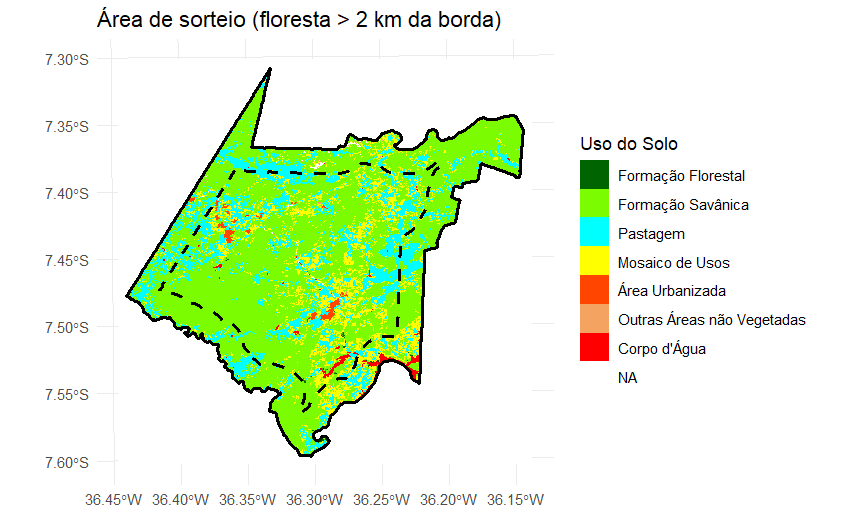
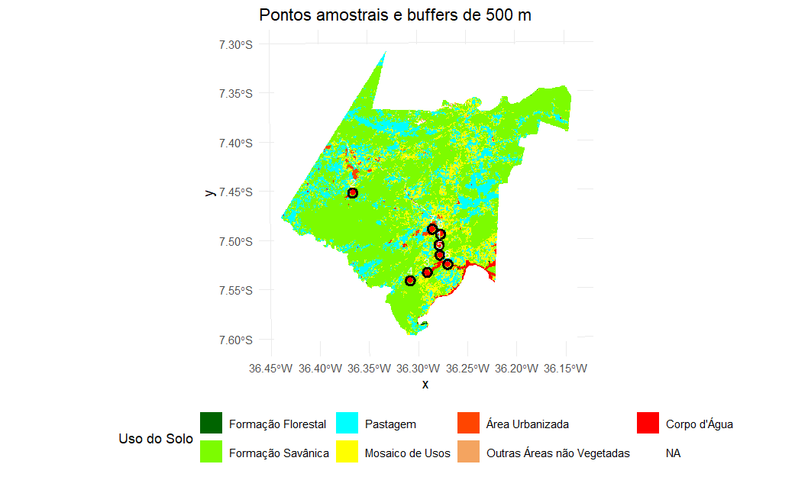
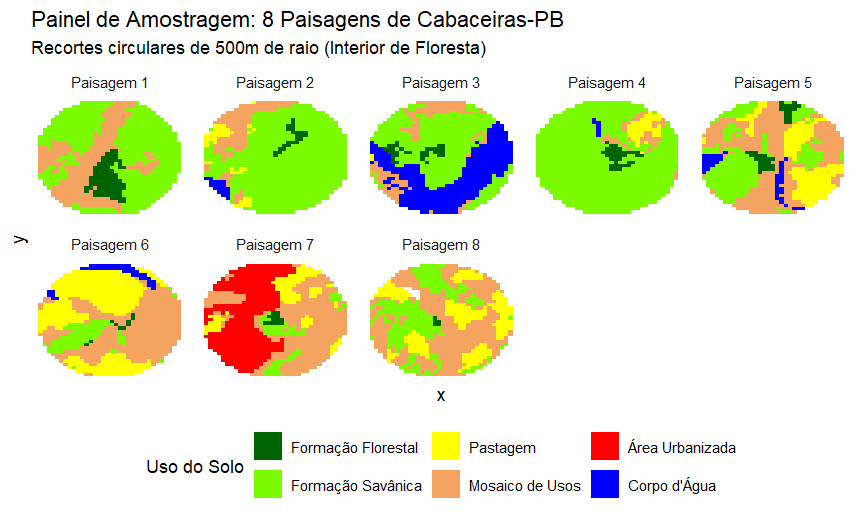
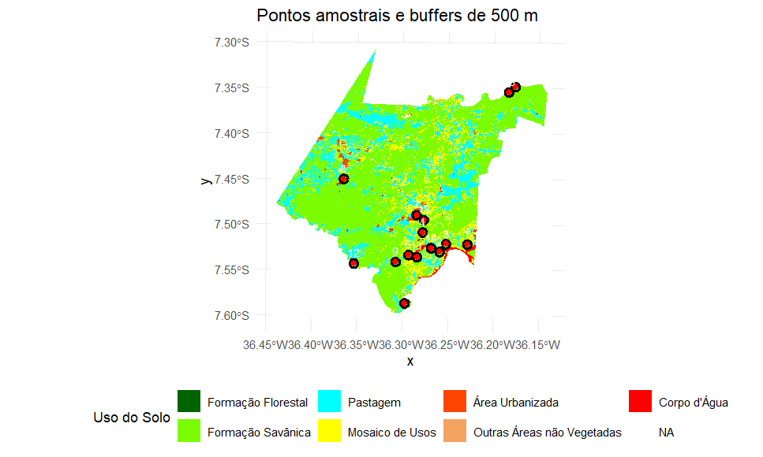
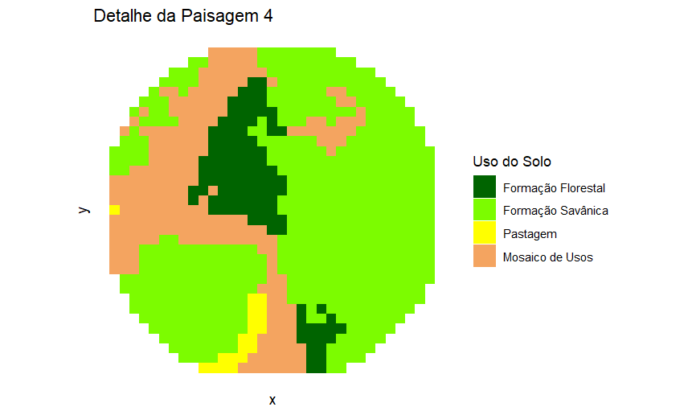
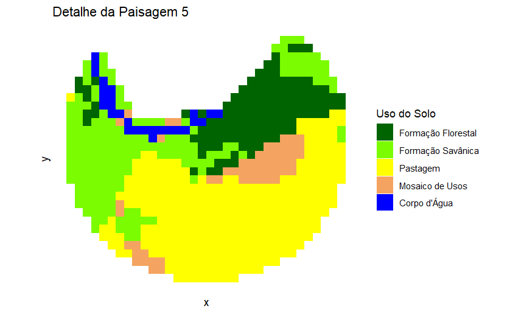

## Exercício 1: O Mosaico no Lance de Vista

**Parte 1: Delimitação e Descrição (A Paisagem Humana)**


Matriz: vegetação de caatinga
Manchas: Açude, solo exposto (áreas de cultivo/pastagem), afloramento rochoso
Corredores: estrada de terra
Grão: Casa como menor elemento

**Parte 2: Escala, Granulação e Transmutação**


Grão: Casa como menor elemento

**Parte 3: A “Lente Biológica” (Escala de Percepção)**


A moita de capim para o garfanhoto é percebida como um ambiente heterogêneo e complexo, onde na área observada tem vários habitats como folhas, troncos e outros animais, que vão ser importantes para a sobrevivência dele ou alimento e abrigo.


**Questões para Discussão**


1. **Ao aumentar o tamanho do grão (Parte 2), você perdeu informações que seriam vitais para a conservação de alguma espécie específica?**

R- Sim, Ao aumentar o tamanho do grão, alguns detalhes da paisagem foram "perdidos", como exemplo a estrada que corta as áreas e age como um corredor. Essa "perda" do elemento, poderia nos enganar em achar que não existiria esse corredor e fazer imaginar que é somente uma área homogenea. 


2. **Como a conectividade funcional mudou entre a sua visão humana e a visão do “gafanhoto”? Elementos que eram barreiras continuam sendo?**

R-O que antes para mim era uma grande área de vegetação com corredores e manchas, para o garfanhoto não é algo que existe, visto que a área em que ele habita a paisagem é diferente da minha e os elementos presentes também.


3. **Você consegue identificar algum distúrbio (natural ou antrópico) que foi o responsável por criar essa heterogeneidade que você desenhou?**

R- Sim, há indícios de distúrbios, como a estrada de terra para o acesso de pessoas para as áreas, as áreas mais abertas sugerindo que há uso do solo para agricultura ou pastagem.


## Exercício 2: Workbook de Ecologia de Paisagens

## 🎬 Apresentação do Workbook




## Exercício 3: Pacotes R para Ecologia de Paisagens

**4 Conhecendo os pacotes principais**

**4.1 terra — Dados Raster**


**4.1.1 Operações básicas com rasters**

```
class       : SpatRaster 
size        : 50, 50, 1  (nrow, ncol, nlyr)
resolution  : 1, 1  (x, y)
extent      : 0, 50, 0, 50  (xmin, xmax, ymin, ymax)
coord. ref. : lon/lat WGS 84 (CRS84) (OGC:CRS84) 
source(s)   : memory
categories  : label 
name        :    label 
min value   : Floresta 
max value   :     Água 
 res(r)            # Resolução espacial
[1] 1 1
 ext(r)            # Extensão geográfica
SpatExtent : 0, 50, 0, 50 (xmin, xmax, ymin, ymax)
 ncell(r)          # Número total de células
[1] 2500
 freq(r)           # Frequência de cada classe (tabela de área)
  layer       value count
1     1    Floresta  1257
2     1    Pastagem   490
3     1 Agricultura   482
4     1        Água   271
```

**4.2 sf — Dados Vetoriais**


**4.3 landscapemetrics — Métricas de Paisagem**


**4.3.1 Calculando múltiplas métricas de uma vez**

**4.3.2 Visualizando fragmentos**


**4.4 tmap — Mapas Temáticos**


**4.5 vegan — Ecologia de Comunidades**


**5 Fluxo de trabalho integrado**

  class    id   area isolamento perimetro_area
  <int> <int>  <dbl>      <dbl>          <dbl>
1     1     1 0.0001       7             4    
2     1     2 0.0005       4             2.4  
3     1     3 0.0072       2             0.833
4     1     4 0.0001       6.32          4    
5     1     5 0.0001       5             4    
6     1     6 0.008        2.24          0.85 


---
title: "Exercícios"
---

## Exercício 4: Amostragem de Paisagens com Restrição de Borda — Murici-AL


**Contexto do exercício**

Neste exercício você trabalhará com um mapa de uso e cobertura da terra do município de Murici (AL), obtido por classificação de imagens de satélite. O objetivo é selecionar 15 pontos amostrais no interior de remanescentes florestais que estejam a pelo menos 2 km da borda do mapa (para evitar efeitos de borda não controlados). Em cada ponto será extraído um buffer circular de 500 m de raio e calculada a composição percentual de cada classe de uso do solo.

Adicionalmente, usaremos o pacote landscapemetrics para calcular métricas de diversidade (Shannon), proporção de floresta e densidade de borda para cada uma das 15 paisagens amostrais.

**Objetivos específicos**

-Compreender a importância da projeção cartográfica para análises métricas.
-Aplicar buffer negativo para restrição de borda de mapa.
-Realizar amostragem aleatória com distância mínima entre pontos.
-Extrair e quantificar a composição da paisagem em buffers circulares.
-Calcular métricas de paisagem com landscapemetrics.
-Produzir um painel de visualização das paisagens amostrais.


**Análise com landscapemetrics:**

Diversidade da paisagem – Índice de Shannon 
% de cobertura florestal – Proporção da classe “Formação Florestal” 
Densidade de borda da classe floresta 


```
id_buffer diversidade_shannon perc_floresta densidade_borda_m_ha
1          1           0.7507504      78.22410             44.41351
2          2           0.7551841      75.62028             53.66340
3          3           1.2318169      49.41922             53.94980
4          4           0.8906418      71.73679             33.35833
5          5           1.0747283      57.00326             63.86672
6          6           0.0000000     100.00000              0.00000
7          7           1.3336246      31.62939             74.45502
8          8           0.8789672      70.95745             25.38790
9          9           1.3141271      23.73247             48.22454
10        10           0.7153538      69.32907             24.34106
11        11           1.0003162      44.07684             58.11278
12        12           1.2808703      13.84452             44.74460
13        13           0.6093134      83.75527             24.81909
14        14           0.0000000     100.00000              0.00000
15        15           1.0722640      23.58591             53.09069
```

**Interpretação dos resultados**


## Exercício 4.1 - Aplicando em outras paisagens CABACEIRAS-PB





**Analise com landscapemetrics**

```
id_buffer diversidade_shannon perc_floresta densidade_borda_m_ha
1         1           0.8940560     9.6153846            25.802457
2         2           0.8111290     2.6737968            15.785032
3         3           1.1411803     3.8054968            23.402228
4         4           0.6002437     3.9487727            19.331190
5         5           1.3292682     4.6038544            18.675012
6         6           1.1492410     1.0582011            12.068451
7         7           1.2258667     1.3888889             7.167349
8         8           1.1166426     0.5291005             3.549544
```

**Interpretação dos resultados**



::: {.callout-warning}
Algumas partes do script foram alteradas visando se encaixar ao mapa de cabaceiras
:::

O erro ocorreu porque o número de rótulos (labels) não correspondia ao número de feições (pontos) no objeto espacial. 

```
geom_spatvector_text(aes(label = 1:15))
```

O código original usa 15 rótulos fixos, mas o número real de pontos era diferente (8), e o ggplot exige que o número de labels seja igual ao número de feições. Então corrigi, com auxilio de inteligencia artificial, criando um identificador (ID) nos pontos:

```
pontos_finais$ID <- 1:nrow(pontos_finais)
```

Com isso, foi criado um ID automático e foi garantido que o número de labels é igual ao número de pontos. Depois foi corrigido o "geom_spatvector_text", para que cada ponto receba seu próprio rótulo e que não tenha conflito de tamanho

```
geom_spatvector_text(
  data = pontos_finais, 
  aes(label = ID), 
  color = "white", 
  size = 3, 
  vjust = -0.8
)
```

## Exercício 5: Exercício Prático: Consultoria Técnica para Criação de Unidades de Conservação (UCs)


•	O objetivo da consultoria é fundamentar tecnicamente a criação de novas Unidades de Conservação, identificando áreas que possuam características espaciais favoráveis à manutenção da biodiversidade e à integridade dos processos ecológicos.
Objetivos do Exercício

1.	Quantificar a estrutura da paisagem utilizando o modelo Mancha-Corredor-Matriz.
2.	Analisar a composição e a configuração espacial de fragmentos florestais.
3.	Propor áreas prioritárias para conservação com base em métricas de paisagem.


**Introdução**

A área de escolha para a realização da instalação da unidade de conservação consiste no município de Cabaceiras localizado no estado da Paraíba e inserido na Mesorregião da Borborema. A região possui uma área aproximada de 400,22 km² e população estimada em 5.336 habitantes. O município está nos domínios da bacia hidrográfica do Rio Paraíba e é drenado pelos rios Taperoá, Paraíba e Boa Vista. A vegetação predominante é a Caatinga arbustiva, típica das regiões semiáridas do Nordeste brasileiro, mas ainda apresentando manchas de floresta densa. Diante disso, Cabaceiras pode funcionar como uma área representativa da Caatinga e está inserida na região do Cariri Paraibano.
O Cariri Paraibano é uma sub-região da Caatinga localizada no estado da Paraíba, no Nordeste do Brasil. Ela possui uma área de 11.233,5 km² e é composta por 29 municípios. Até o final do século XVIII, o Cariri Paraibano era composto por paisagens de bosques e florestas ribeirinhas, que foram substituídas por áreas de pecuária e plantio de algodão. Contudo, as atividades agrícolas de algodão declinaram a partir dos anos 1950, deixando áreas severamente degradadas. Atualmente, a região é um mosaico de uso do solo e degradação da vegetação originária, com algumas áreas florestais ainda preservadas (Souza, 2009, 2016).
A Caatinga é considerada a maior floresta sazonalmente seca do mundo, abriga inúmeras espécies endêmicas e possui grande relevância ecológica, social e cultural. Apesar disso, a conservação desse bioma recebe pouca prioridade, refletido na baixa quantidade de áreas protegidas existentes. Atualmente, apenas cerca de 8,9% da área da Caatinga encontra-se protegida por Unidades de Conservação (UCs), sendo a maior parte representada por Áreas de Proteção Ambiental (APAs), categoria considerada menos restritiva. Esse cenário evidencia a necessidade de criação e ampliação de novas Unidades de Conservação na Caatinga, especialmente em regiões suscetíveis à degradação ambiental, como o Cariri Paraibano.


**Descrição da metodologia de amostragem**

**Procedimentos Técnicos**

**1. Obtenção e Preparo dos Dados**

Foi selecionado o município brasileiro (Cabaceiras – PB) e foi realizado o download do mapa de uso e cobertura da terra mais recente da plataforma MapBiomas (2024). Foi utilizado o programa Rstudio para a realização dos processamewntos dos dados raster . 

**2. Delineamento Amostral: Pontos-Paisagem e Quantificação da Estrutura (Métricas de Paisagem)**

O processamento dos dados espaciais foi realizado no Rstudio. De inicio foi garantido que o sistema de coordenadas estivesse projetado corretamente para a região de Cabaceiras (fuso UTM 24 Sul, EPSG: 31984). Em seguida, foi feito um sorteio de pontos amostrais de forma aleatória, restritos espacialmente à classe de uso definida como "Floresta".
Ao redor de cada ponto sorteado, foi estabelecido um buffer de 500 metros de raio. Porem, para assegurar a independência das amostras, foi definida uma distância mínima de 1.000 metros entre os pontos, para garantir que os buffers não se tocassem ou se sobrepusessem. A organização dos mapas, o ajuste de coordenadas, o recorte da área de estudo e a criação das zonas de amortecimento, foi feita com o auxílio do pacote terra.
Já para compreender a saúde ecológica dessas manchas florestais e conseguir quantificar a estrutura espacial, foram calculadas métricas de ecologia de paisagem utilizando o pacote landscapemetrics. As medidas foram realizadas nos níveis de mancha, classe e paisagem, extraindo dados como área, perímetro, área central, índice de forma, isolamento, percentual de floresta, densidade da borda e a diversidade de Shannon dentro de cada buffer.
Por fim, o tratamento e a estruturação tabular dos resultados foram organizados com o pacote tidyverse, enquanto a elaboração dos mapas e das representações visuais foi feita utilizando o pacote ggplot2 com a extensão tidyterra.

**Resultados**

A análise do mapa de uso e cobertura do solo nos mostra que a paisagem é dominada pela classe de Formação Savânica e por áreas de uso humano representadas principalmente por Pastagem e Mosaico de Usos. As Formações Florestais apresentam uma distribuição bastante restrita e fragmentada, formando pequenas manchas isoladas dentro da matriz. Já outras classes, como Corpos d'Água e Áreas Urbanizadas, ocorrem em pequenas proporções e de forma pontual pelo território.


Após as analises foram sorteados 15 pontos ao longo do território de cabaceiras visando analisar qual desses pontos de floresta melhor serviriam para a implementação da unidade de conservação. A distribuição dos pontos acompanhou a ocorrência natural da formação florestal e se concentraram no centro-sul e nordeste do mapa. Para evitar erros, os pontos que cairam muito na borda foram ignorados, para evitar erros e problemas causados por efeitos de borda não controlados fora da área mapeada. A única exceção foi a paisagem referente ao ponto 5 na parte sul, que foi mantida na amostragem por apresentar potencial estratégico para a futura criação da unidade de conservação.



**1.1	Quantificação da Estrutura (Métricas de paisagem e mancha)**

A análise das métricas espaciais para os 15 buffers mostrou variações significativas entre os buffers. Em termos de representatividade da formação florestal, o Buffer 5 se destaca como o melhor cenário, pois possui maior proporção de cobertura florestal (18,26%) e também demonstra alta heterogeneidade na paisagem (Índice de Shannon de 1,34). Porém, ela possui a maior densidade de borda do conjunto (48,08 m/ha), o que pode nos dizer que mesmo tendo uma boa quantidade de floresta, a mancha tem formatos irregulares ou pode estar fragmentada na matriz. O Buffer 4 também demonstrou resultados positivos, sendo a segunda área com maior percentual florestal (11,76%), apresentando um índice de shannon de 0,98 e densidade de borda de 36,20, números menores que o buffer 5, mas que ainda a colocam como possível área.
Em contrapartida, os piores cenários foram vistos nos Buffers 3 e 13, ambos possuindo cerca de 0,5% de floresta em sua composição, os tornando inviáveis para áreas prioritárias. Em relação à composição da paisagem, o Buffer 2 foi o que apresentou a maior diversidade de classes (Índice de Shannon de 1,44), indicando uma paisagem bem heterogênea. Já os Buffers 15 e 10 obtiveram os menores valores de diversidade (Shannon de 0,08 e 0,17, respectivamente). 

```
 
> print(metricas_paisagem)
   id_buffer diversidade_shannon perc_floresta densidade_borda_m_ha
1          1          1.23057611     3.6286019            22.206778
2          2          1.43889928     6.7235859            37.608253
3          3          1.28042224     0.5393743             3.620376
4          4          0.98333430    11.7583603            36.203763
5          5          1.33698655    18.2584270            48.078801
6          6          1.32890281     3.8379531            23.614271
7          7          1.25104207     1.3874066             7.163477
8          8          0.79134328     2.6539278            15.675999
9          9          0.62975187     4.0000000            19.592302
10        10          0.17227395     1.0245902            11.003570
11        11          1.12990123     2.1668472             7.272132
12        12          0.75669105     2.1164021             6.510931
13        13          1.11726105     0.5319149             3.570307
14        14          1.13870407     1.0660981            12.164928
15        15          0.08304324     1.6245487            10.904260

```


A avaliação no nível da mancha nos deu um bom detalhamento sobre a qualidade e a viabilidade dos fragmentos florestais presentes. O Buffer 4 registou a maior área média de mancha (4,84 ha) e a maior core area (2,18 ha). O Buffer 5 também tem potencial, pois além de apresentar uma boa core area (1,19 ha), as suas manchas possuem índices de forma e dimensão fractal mais próximos de 1 (1,43 e 1,06, respetivamente).
Já os Buffers 3, 10, 13, 14 e 15 configuram os piores cenários estruturais. Nestas áreas, as manchas florestais possuem médias inferiores a 0,5 ha e apresentam um valor de core area igual a zero. O Buffer 10 demonstrou ser altamente isolado, apresentando a maior distância para o vizinho mais próximo (enn de 364 m). Diversos buffers (3, 7, 8, 9, 11, 12 e 13) são uma única mancha florestal isolada dentro da zona de amortecimento.

```
 plot_id  area   core   enn  frac perim shape
     
 1       1 1.51  0.0888 107.   1.12  924.  1.83
 2       2 1.40  0.244  143.   1.10  790.  1.68
 3       3 0.444 0      NaN    1.03  298.  1.12
 4       4 4.84  2.18   246.   1.11 1520.  1.81
 5       5 2.31  1.19   115.   1.06  751.  1.43
 6       6 1.60  0.178   89.4  1.14  983.  1.94
 7       7 1.15  0.178  NaN    1.07  596.  1.39
 8       8 2.22  0.0888 NaN    1.16 1311.  2.20
 9       9 3.28  0.977  NaN    1.15 1609.  2.22
10      10 0.222 0      364.   1.07  268.  1.38
11      11 1.78  0.533  NaN    1.02  596.  1.12
12      12 1.07  0.0888 NaN    1.08  596.  1.44
13      13 0.444 0      NaN    1.03  298.  1.12
14      14 0.444 0      233.   1.14  507.  1.86
15      15 0.400 0      215.   1.04  298.  1.19
```


A representação cartográfica dos 15 recortes circulares (Painel de Amostragem) corrobora visualmente com os dados quantitativos obtidos pelas métricas. 


::: {.callout-warning}
Algumas imagens estão cortadas pois elas se localizam na borda do mapa
:::


A Paisagem 4 possui uma mancha florestal contínua e mais centralizada, imersa em grande parte em uma matriz de formação savânica e de mosaico de usos. Justificando o valor de core area, o que pode indicar um fragmento mais protegido das pressões externas.
Já a Paisagem 5 se destaca por uma extensa faixa florestal localizada na borda do limite do mapa e diretamente contígua a um corpo d'água. Isto lhe da confere um valor ecológico, pois pode sugerir a presença de uma mata ciliar ou uma vegetação associada a recursos hídricos. Porem, é possível ver que essa mesma floresta está cercada por área de pastagem, o que explicaria o valor da densidade de borda, indicando uma área de alta pressão antrópica e vulnerabilidade ao efeito de borda.




**4. Interpretação e Proposta de Manejo**

**•	Quais pontos-paisagem apresentam a melhor integridade ecológica?**

Os Buffers 4 e 5.

**•	Existem áreas que funcionam como trampolins ecológicos (stepping stones) ou que facilitam a conectividade funcional?**


Sim. A análise da métrica de isolamento mostra que áreas como os Buffers 6 (89,4 m), 1 (107 m) e 5 (115 m) possuem manchas florestais relativamente próximas umas das outras. Esses fragmentos menores podem então atuar como stepping stones dentro da matriz dominante de formação savânica e pastagem. Eles podem ser fundamentais para facilitar a conectividade funcional, pois acaba reduzindo a distância de voo ou deslocamento da fauna, o que permite fluxo gênico e dispersão de sementes entre manchas maiores que estariam isoladas.

**•	Onde o governo deve instalar a nova UC? Justifique com base em conceitos como o limiar crítico de habitat (ex: regra dos 30%) e a viabilidade populacional das manchas.**


O governo deve instalar a nova UC na área correspondente ao Buffer 5.
Nenhuma das paisagens amostradas atinge o valor mínimo ideal do limiar crítico ( Buffer 5 é o que chega mais perto, com 18,26%). Por estar abaixo do limiar crítico, a escolha do Buffer 5 é fundamental, pois ele possui a maior base florestal para iniciar um processo de recuperação e já conta com uma área central viável (1,19 ha) para sustentar populações remanescentes, além de proteger um corpo d'água.
Diante desse cenário de fragmentação, a criação da UC não deve seguir um modelo de proteção estrita (fechada/cercada). A recomendação é a criação de uma Unidade de Conservação de Uso Sustentável, integrando a comunidade local. Dessa forma, é possível utilizar técnicas de agricultura sustentável (como sistemas agroflorestais) integradas à restauração ecológica das pastagens de entorno. Isso permitirá que, a médio e longo prazo, a cobertura florestal local se expanda, ultrapassando o limiar de 30% e garantindo a resiliência ecológica da paisagem sem excluir as pessoas que ali vivem.

**Parecer Técnico Resumido: Indicação clara de qual área deve ser protegida e por quais razões ecológicas espaciais.**


A área escolhida foi a 5, pois a mesma se destaca por ter a maior proporção de cobertura florestal entre todas as áreas amostradas (18,26%) e por manter uma core area viável (1,19 ha) para o refúgio da biodiversidade. O fator ecológico de maior relevância é a associação desse remanescente florestal com um corpo d'água, sugerindo a possível presença de mata ciliar. A proteção dessa área vai poder garantir a conservação da flora e fauna nativa e também a manutenção dos recursos hídricos, um serviço ecossistêmico crítico na região da Caatinga.
Embora as métricas apontem uma elevada densidade de borda (48,08 m/ha) devido a pressão das áreas de pastagem e do mosaico de usos do entorno, essa vulnerabilidade justifica necessidade de intervenção. 
Porém, ao invés de adotar um modelo de conservação que visa o isolamento da área, a heterogeneidade e a ocupação antrópica dessa paisagem oferecem o cenário ideal para a criação de uma Unidade de Conservação de Uso Sustentável. Tendo em mente que presença de moradores e atividades agrícolas não deve ser vista como um impeditivo, mas como uma oportunidade para aplicar métodos de integração sustentável, como sistemas agroflorestais e técnicas de agricultura aliadas à restauração ecológica das bordas da floresta.


## Por dentro do Exercicio 5: script e comentários

**TENTATIVA CABACEIRAS -------------------------------------**

```{r}
library(terra)
library(tidyverse)
library(tidyterra)
library(landscapemetrics)


r_cabaceiras <- rast("2024_cabaceiras.tif")

r_utm <- project(r_cabaceiras, "EPSG:31984", method = "near")

#Projeção e legenda

legenda <- data.frame(
  id = c(3, 4, 11, 15, 20, 21, 24, 25, 33),
  Categoria = c("Formação Florestal", "Formação Savânica", "Campo Alagado",
                "Pastagem", "Cana", "Mosaico de Usos", "Área Urbanizada",
                "Outras Áreas não Vegetadas", "Corpo d'Água"),
  Cores = c("#006400", "#7cfc00", "#00ffff", "#ffff00", "#ff4500",
            "#f4a460", "#ff0000", "#d3d3d3", "#0000ff")
)

levels(r_utm) <- legenda[,1:2]


# definindo a área de sorteio (SEM restrição de borda)

vetor_total <- as.polygons(r_utm, dissolve = TRUE)

# limite do município
municipio_limite <- aggregate(vetor_total)

# selecionar apenas floresta
floresta <- vetor_total[vetor_total$Categoria == "Formação Florestal", ]

# área de sorteio = floresta inteira dentro do município
area_sorteio <- mask(floresta, municipio_limite)

# um único objeto
if (is.list(area_sorteio)) {
  area_sorteio <- do.call(rbind, area_sorteio)
}

# checando...
if (nrow(area_sorteio) == 0) {
  stop("Erro: Nenhuma área de floresta encontrada no município.")
}

#visualizando

ggplot() +
  geom_spatraster(data = r_utm) +
  scale_fill_manual(values = legenda$Cores, na.value = "white", name = "Uso do Solo") +

  # limite do município
  geom_spatvector(data = municipio_limite, fill = NA, color = "black", linewidth = 1) +

  # área de floresta total
  geom_spatvector(data = floresta, fill = "darkgreen", alpha = 0.3, color = NA) +

  # área de sorteio (floresta dentro do município)
  geom_spatvector(data = area_sorteio, fill = "forestgreen", alpha = 0.5, color = NA) +

  labs(title = "Mapa de uso e cobertura do solo em Cabaceiras-PB)") +
  theme_minimal()

#sorteio de pontos com distancia minima

set.seed(1234)
pontos_finais <- NULL
tentativas <- 0

while(is.null(pontos_finais) || nrow(pontos_finais) < 15) {
  tentativas <- tentativas + 1
  cand <- spatSample(area_sorteio, size = 1, method = "random")

  if (nrow(cand) > 0) {
    if (is.null(pontos_finais)) {
      pontos_finais <- cand
    } else {
      dists <- distance(cand, pontos_finais)
      if (min(dists) >= 1000) {
        pontos_finais <- rbind(pontos_finais, cand)
      }
    }
  }

  if (tentativas > 5000) break
}

#buffers e extração da composição da paisagem

# Verificar CRS
if (!identical(crs(pontos_finais), crs(r_utm))) {
  pontos_finais <- project(pontos_finais, crs(r_utm))
}

buffers <- buffer(pontos_finais, width = 500)
buffers$id_paisagem <- 1:nrow(buffers)

# Extração e processamento
extracao <- terra::extract(r_utm, buffers)
nome_col_raster <- names(extracao)[2]

tabela_final <- extracao %>%
  rename(id_buffer = ID, categoria_bruta = !!sym(nome_col_raster)) %>%
  group_by(id_buffer) %>%
  mutate(total_px = n()) %>%
  group_by(id_buffer, categoria_bruta) %>%
  summarise(
    pixels = n(),
    percentagem = (pixels / first(total_px)) * 100,
    .groups = "drop"
  ) %>%
  mutate(Categoria_Limpa = as.character(categoria_bruta)) %>%
  left_join(legenda %>% select(Categoria, Cores), by = c("Categoria_Limpa" = "Categoria"))

write.csv(tabela_final, "uso_solo_cabaceiras_final.csv", row.names = FALSE)
writeVector(pontos_finais, "pontos_final.shp", overwrite=TRUE)

writeVector(buffers, "buffers_500m.shp", overwrite=TRUE)

#visualização

library(terra)

# adicionar ID aos pontos
pontos_finais$ID <- 1:nrow(pontos_finais)

ggplot() +
  geom_spatraster(data = r_utm) +
  scale_fill_manual(values = legenda$Cores, na.value = "white", name = "Uso do Solo") +
  geom_spatvector(data = buffers, fill = NA, color = "black", linewidth = 1) +
  geom_spatvector(data = pontos_finais, color = "red", size = 2) +
  geom_spatvector_text(data = pontos_finais, aes(label = ID),
                       color = "white", size = 3, vjust = -0.8) +
  labs(title = "Pontos amostrais e buffers de 500 m") +
  theme_minimal() +
  theme(legend.position = "bottom")


#analise com landscapemetrics ----------------------------------------

# Identificar o valor numérico da classe Floresta
id_floresta <- legenda$id[legenda$Categoria == "Formação Florestal"]

# Lista para armazenar métricas de cada buffer
metricas_lista <- list()

# armazenar as métricas de patch
metricas_patch_lista <- list()

for(i in 1:nrow(buffers)) {
  # Recortar o raster para o buffer i
  crop_i <- crop(r_utm, buffers[i,])
  mask_i <- mask(crop_i, buffers[i,])

  # Calcular duversidade Shannon diversity
  shannon <- lsm_l_shdi(mask_i)

  # Calcular métricas de classe para todas as classes
  pland_all <- lsm_c_pland(mask_i)
  ed_all <- lsm_c_ed(mask_i)


  # Calcula as métricas de patch
  p_area  <- lsm_p_area(mask_i)
  p_core  <- lsm_p_core(mask_i)
  p_perim <- lsm_p_perim(mask_i)
  p_shape <- lsm_p_shape(mask_i)
  p_frac  <- lsm_p_frac(mask_i)
  p_enn   <- lsm_p_enn(mask_i)

  # Combina todas as métricas de patch do buffer
  patch_all <- bind_rows(p_area, p_core, p_perim, p_shape, p_frac, p_enn)

  # Filtrando apenas para a classe floresta e adicionando o id do buffer
  patch_floresta <- patch_all %>%
    filter(class == id_floresta) %>%
    mutate(id_buffer = i)

  # Guardando na nova lista
  metricas_patch_lista[[i]] <- patch_floresta


  # Filtrar apenas a classe floresta
  pland_floresta <- pland_all %>% filter(class == id_floresta)
  ed_floresta <- ed_all %>% filter(class == id_floresta)

  # Extrair valores (se não houver floresta, colocar NA ou 0)
  div_shannon <- shannon$value
  perc_floresta <- ifelse(nrow(pland_floresta) > 0, pland_floresta$value, 0)
  dens_borda <- ifelse(nrow(ed_floresta) > 0, ed_floresta$value, NA)

  # Guardar
  metricas_lista[[i]] <- data.frame(
    id_buffer = i,
    diversidade_shannon = div_shannon,
    perc_floresta = perc_floresta,
    densidade_borda_m_ha = dens_borda
  )
}

# Combinar tudo
metricas_paisagem <- bind_rows(metricas_lista)
metricas_patch <- bind_rows(metricas_patch_lista) # Combina a nova rodada

# Transformar a tabela de manchas no formato do professor (1 linha por buffer)
tabela_patch <- metricas_patch %>%
  # Agrupa pelo buffer e pela métrica
  group_by(id_buffer, metric) %>%
  # Tira a média dos valores das manchas para cada métrica dentro do buffer
  summarise(value = mean(value, na.rm = TRUE), .groups = "drop") %>%
  # Transforma as linhas das métricas em colunas
  pivot_wider(names_from = metric, values_from = value) %>%
  # Renomeia id_buffer para plot_id para ficar idêntico ao exemplo
  rename(plot_id = id_buffer)

# Visualizar como ficou
print(tabela_patch)

print(metricas_paisagem)


write.csv(metricas_paisagem, "metricas_landscapemetrics.csv", row.names = FALSE)

write.csv(metricas_patch, "metricas_patch_landscapemetrics.csv", row.names = FALSE)


#painel de paisagens

lista_recortes <- list()
for(i in 1:nrow(buffers)) {
  crop_i <- crop(r_utm, buffers[i, ])
  mask_i <- mask(crop_i, buffers[i, ])
  df_i <- as.data.frame(mask_i, xy = TRUE, cells = TRUE)
  df_i$id_buffer <- paste("Paisagem", i)
  lista_recortes[[i]] <- df_i
}
df_painel <- bind_rows(lista_recortes)

ggplot(df_painel) +
  geom_tile(aes(x = x, y = y, fill = Categoria)) +
  scale_fill_manual(values = setNames(legenda$Cores, legenda$Categoria)) +
  facet_wrap(~id_buffer, nrow = 3, ncol = 5, scales = "free") +
  theme_minimal() +
  labs(title = "Painel de Amostragem: 15 Paisagens de Cabaceiras - PB",
       subtitle = "Recortes circulares de 500m de raio (Interior de Floresta)",
       fill = "Uso do Solo") +
  theme(axis.text = element_blank(),
        axis.ticks = element_blank(),
        panel.grid = element_blank(),
        legend.position = "bottom")


#Visulaizando somente a paisagem 5

df_5 <- df_painel %>% filter(id_buffer == "Paisagem 5")

ggplot(df_5) +
  geom_tile(aes(x = x, y = y, fill = Categoria)) +
  scale_fill_manual(values = setNames(legenda$Cores, legenda$Categoria)) +
  coord_equal() +
  theme_minimal() +
  labs(title = "Detalhe da Paisagem 5",
       fill = "Uso do Solo") +
  theme(axis.text = element_blank(),
        axis.ticks = element_blank(),
        panel.grid = element_blank())

#Visualizando somente a paisagem 4

df_4 <- df_painel %>% filter(id_buffer == "Paisagem 4")

ggplot(df_4) +
  geom_tile(aes(x = x, y = y, fill = Categoria)) +
  scale_fill_manual(values = setNames(legenda$Cores, legenda$Categoria)) +
  coord_equal() +
  theme_minimal() +
  labs(title = "Detalhe da Paisagem 4",
       fill = "Uso do Solo") +
  theme(axis.text = element_blank(),
        axis.ticks = element_blank(),
        panel.grid = element_blank())
```


